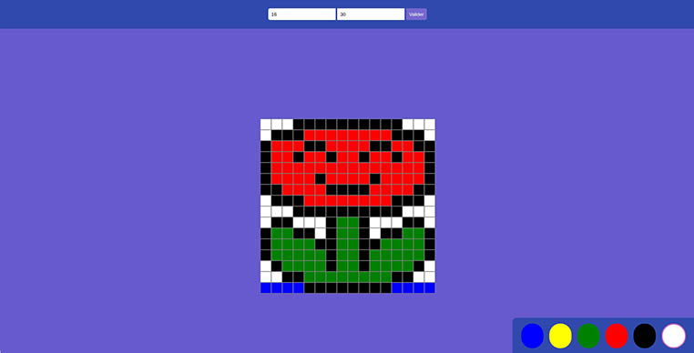

# portfolio-game-pixel-art

Petit jeu dont le but est d'utiliser la grille de pixel et la palette de couleur afin de dessiner.

## Langages utilisés pour réaliser cette application

- HTML5
- CSS3
- JS

## Aperçu

